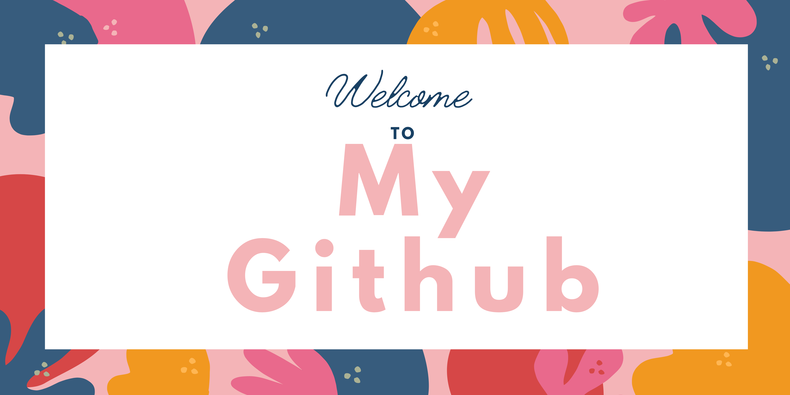

### ✨ Hi, I'm Anoushka Shetty (she/her/hers) ✨

## I'm currently a third year student at UofT

- 🎓 I'm pursuing a double major in criminology,law and society and computer science.
- 🔭 I’m currently working on a movie review website with java as my backend.
- 🌱 I’m currently learning about html and css for my frontend.
- 💫 I love to try new things whenever the opportunity is given.
- ⭐ Open to collaborate with new people
- 🎠 Fun fact: I love to paint and consider myself as a self-proclaimed movie buff. I also used to play the violin when I was younger.

### 🌸 2021 Goals: Learn a new hobby and learn some new recipes. 🌸

